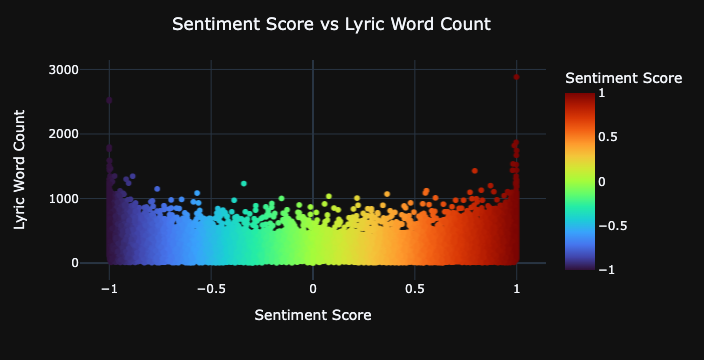

## Sentiment Based Song Recommender
​
#### PROJECT OVERVIEW
​
Several studies have shown that music has a profound effect on mood, memory, anxiety and depression.  With a national epidemic on anxiety and depression in the wake of COVID 19 and other traumatic events, this project seeks to help users find music that will help them change their mood based on song lyrics. The audience in mind for this project is a semi-technical group at a mental-health awareness non-profit group. The goal of this project is to use Natural Language Processing (NLP) to analyze text submitted by a user--whether lyrics, poetry, or text submissions--and recommend music with lyrics that match or elevate the person's mood. 
​
#### EXECUTIVE SUMMARY
This project relied on a dataset on Kaggle containing the song lyrics of 150,000 songs found on Spotify, a globally used music streaming platform. The original dataset had a Spotify-provided metric called "valence score" for each song. Valence score as described by Spotify as "the musical positiveness conveyed by a track(song)". It was unclear how Spotify calculated that valence score, and as a result we used VADER natural language processing to obtain a vader valence score for the lyrics. The data was first cleaned using a regex tokenizer to remove any html coding and punctation in the song lyrics. Once the lyrics were cleaned, they were processed through the vader sentiment analyzer to obtain a vader compound valence score.  The vader compound score represents the sum of each word in the lexicon and then normalized to be between -1 (most extreme negative) and +1 (most extreme positive). We then created a function to obtain the vader compound score for the user input text (song lyrics, poetry, and prose) and then compare that to the dataset to generate songs that match the valence scores of the words that were given.  

Upon doing some data analysis, we were able to spot trends in word counts and popular words used. The graph below demonstrates that songs with extreme sentiment scores (very high sentiment score or very low sentiment scores) have extreme word counts:

The two graphs below demonstrate the most popular words songs with high and low sentiment scores:

​
The final product is an interactive website which allows users to input text and get the recommendations included in the link below. Additionally here is a link to the repository with the full data and code that went into this project: <a href>https://we.tl/t-Q0PXuoZ46v</a>  
​
Recommendations for future development of this project include expanding the dataset to more songs and including genre for recommendations.
​
​
#### TABLE OF CONTENTS
[Data Sources](#data-sources) 
[Data Dictionary](#data-dictionary) 
[Other Sources](#sources) 
​
#### Data Sources
<a href>https://www.kaggle.com/edenbd/150k-lyrics-labeled-with-spotify-valence</a>  
​
#### Data Dictionary
​
| Feature       	| Type   	| Dataset            	| Description                                                                                                                                                                                     	|
|---------------	|--------	|--------------------	|-------------------------------------------------------------------------------------------------------------------------------------------------------------------------------------------------	|
| artist        	| object 	| Kaggle DataSet     	| Name of the artist of the song                                                                                                                                                                  	|
| song          	| object 	| Kaggle DataSet     	| Title of the song                                                                                                                                                                               	|
| clean_lyrics  	| object 	| Engineered Feature 	| Tokenized lyrics of song with html coding and punctuation removed                                                                                                                               	|
| vader_valence 	| float  	| Engineered Feature 	| Vaderized Compound Score of lyrics: The compound score is between -1 and 1 with -1 representing the most extreme negative sentiment and 1 representing the most extreme positive sentiment.|
​
#### Other Sources
​
Harvard Study on Music and Mood: <a href>https://www.health.harvard.edu/mind-and-mood/music-can-boost-memory-and-mood</a>  

VADER Explanation: <a href>https://www.geeksforgeeks.org/python-sentiment-analysis-using-vader/</a> 
